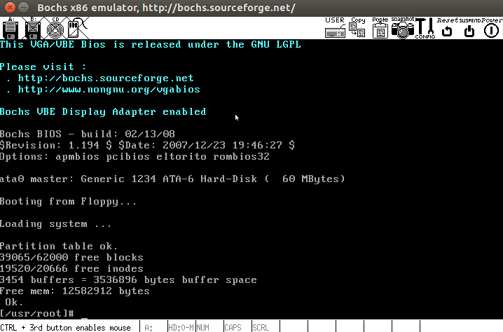

## hit-oslab前言

最近在学习哈工大李志军老师的操作系统课程，这门课程最大的特点就是从操作系统源码级来讲述操作系统的核心知识点。这正合这段时间自己对底层基础知识学习的渴望。这篇文章主要记录一下搭建课程相关实验环境的方法，以便节省后来者时间。 

其实这门课程，[实验楼](https://www.shiyanlou.com/courses/115)提供了一个现成的实操环境，来帮助完成课程学习。但碍网络，平台操作不便和无法保存实验环境等因素，自己动手在本地搭建一个相关的实验环境还是很有必要的。

github上作者[DeathKing](https://github.com/DeathKing)也提供了一个相关的[环境项目](https://github.com/DeathKing/hit-oslab)，但该项目最近好像没维护了，安装后Bochs虚拟机启动可能会出现无法加载操作系统的问题。

最后，在经过各种尝试以后发现，可以将实验楼环境相关文件包下载到本地，再安装必要的相关工具后就可在本地构建出一个实验环境。   


## 准备

### 操作系统

该环境构建在ubuntu操作系统之上，所以可以通过在本地安装ubuntu虚拟机构建所需操作系统。本次环境安装采用的是[ubuntu 16.04](http://releases.ubuntu.com/16.04/)*（不建议用太新的版本）*

### 实验包下载

在本地ubuntu命令行中键入如下命令，下载实验包，其中包括了包括了实验所需的所有工具和文件*（下载前先在本地先安装git工具）*

- ```
  git clone https://github.com/steverao/hit-oslab/oslab.git ~/
  ```


## 配置

- 下载成功以后进入相关目录，并尝试如下命令通过Bochs启动Linux 0.11操作系统。

  ```
  cd oslab
  ./run
  ```

- 如出现如下错误

  ```
  ./bochs/bochs-gdb: error while loading shared libraries: libSM.so.6: cannot open shared object file: No such file or directory
  ```

- 则显示系统缺少相关的链接库，通过以下命令下载

  ```
  sudo apt-get install libsm6:i386
  ```

- 再次运行如出现如下错误

  ```
  ./bochs/bochs-gdb: error while loading shared libraries: libX11.so.6: cannot open shared object file: No such file or directory
  ```

- 则通过如下命令下载对应缺失的库

  ```
  sudo apt-get install libx11-6:i386
  ```

- 再次运行如出现如下错误

  ```
  ./bochs/bochs-gdb: error while loading shared libraries: libXpm.so.4: cannot open shared object file: No such file or directory
  ```

- ###### 则通过如下命令下载对应缺失的库

  ```
  sudo apt-get install libxpm4:i386
  ```

- 经过上述步骤，再次运行，如果出现如下画面则表示成功


<div align="center"></div>


##参考资料

- [DeathKing的hit-oslab自动配置实验环境](https://github.com/DeathKing/hit-oslab)
